# Report

## Assignment1

1. `stack run -- +RTS -lf -N4 -s`

   | 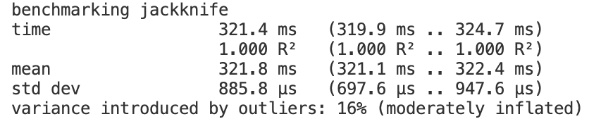 | 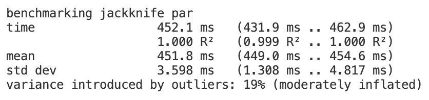 |
   | ------------------------------------------------------------ | ------------------------------------------------------------ |
   | 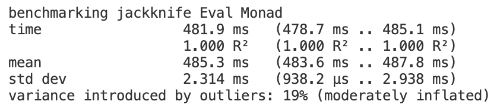 | 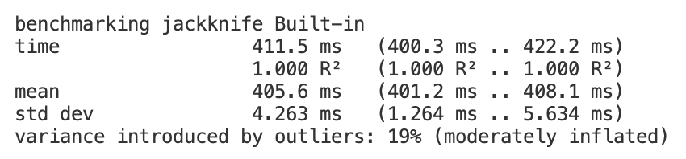 |
   | 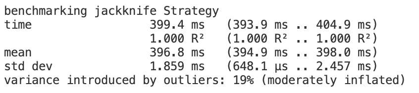 | 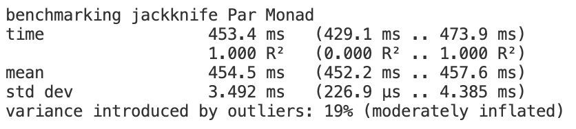 |

   It is obvious that the parallel map functions did not speed up the progress. 

   When we check the event log, we can see that the GC (Garbage Collection) part limited the parallel speedup.

   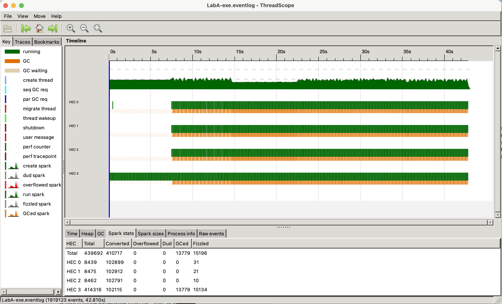

2. `stack run -- +RTS -lf -N4 -s -A100M`

   After trying to set a large memory allocation with the "+RTS -A100M" flag, we observed that the parallel functions indeed accelerated the map process. This confirms that garbage collection was the bottleneck limiting our parallel speedup.

   | 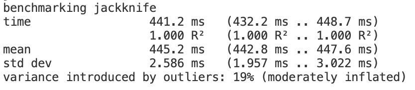 | 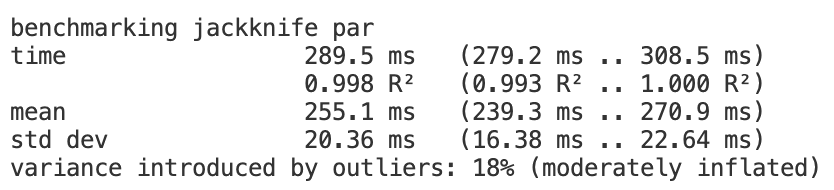 |
   | ------------------------------------------------------------ | ------------------------------------------------------------ |
   | 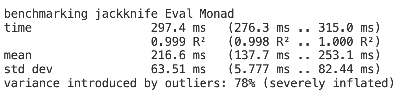 | 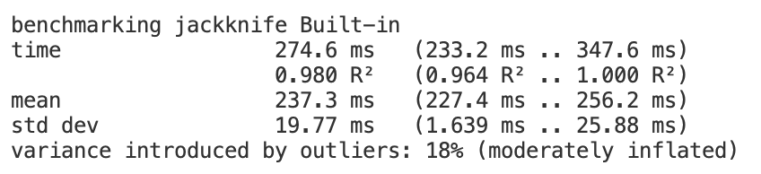 |
   | 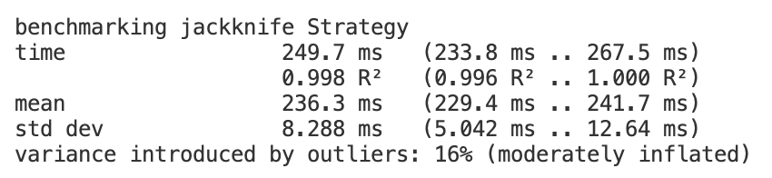 | 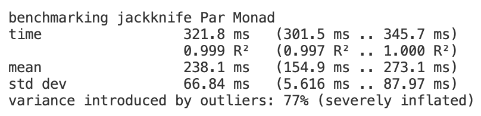 |

   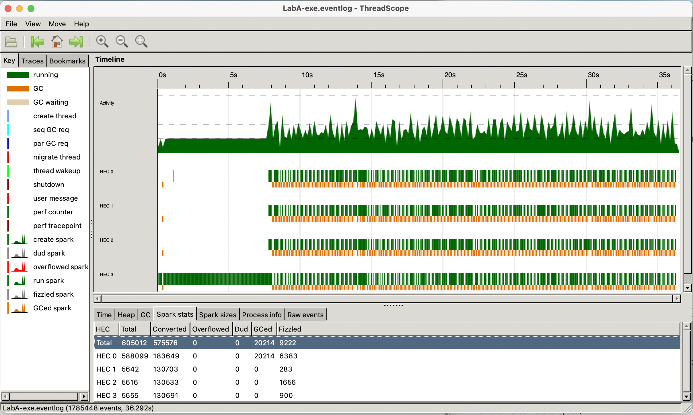

## Assignment2

1. `stack run -- +RTS -lf -N4 `

   Chose to parallelize mergesort and quicksorts. 

   | 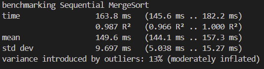 | 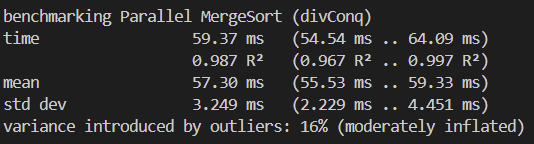 |
   | ------------------------------------------------------------ | ------------------------------------------------------------ |
   | 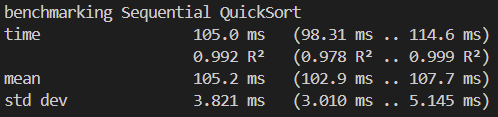 | 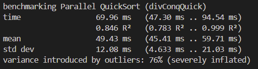 |  

   As can be seen, run time stastistics significantly improved after running the alogirthms in parallel using the Par Monad.

## Assignment3

1. ```haskell
   -- Like evalBufferWHNF but sparks the list elements when pushing them
   -- into the buffer.
   -- Not to be exported; used in parBuffer and for optimisation.
   parBufferWHNF :: Int -> Strategy [a]
   parBufferWHNF n0 xs0 = return (ret xs0 (start n0 xs0))
     where -- ret :: [a] -> [a] -> [a]
              ret (x:xs) (y:ys) = y `par` (x : ret xs ys)
              ret xs     _      = xs
   
           -- start :: Int -> [a] -> [a]
              start 0   ys     = ys
              start !_n []     = []
              start !n  (y:ys) = y `par` start (n-1) ys
   
   -- | Like 'evalBuffer' but evaluates the list elements in parallel when
   -- pushing them into the buffer.
   parBuffer :: Int -> Strategy a -> Strategy [a]
   parBuffer n strat = parBufferWHNF n . map (withStrategy strat)
   ```

   The `parBuffer` applies a given strategy to each element and uses `parBufferWHNF` to manage sparks. This allows users to specify how each element should be evaluated.

   - The `start` function creates sparks for the first n elements of the list, establishing a buffer of elements that will be evaluated in parallel.
   - The `ret` function maintains the buffer of `n` sparked elements ahead of the current processing position by creating new sparks deeper in the list.

2. Use `rsa1.hs` and `rsa2.hs` to test how `parBuffer` can affect performance.

   ```haskell
   -- rsa1
   encrypt n e = B.unlines
               . withStrategy (parList rdeepseq)
               . map (B.pack . show . power e n . code)
               . chunk (size n)
   
   -- rsa2
   encrypt n e = B.unlines
               . withStrategy (parBuffer 100 rdeepseq)
               . map (B.pack . show . power e n . code)
               . chunk (size n)
   ```

   Experiment by `stack run encrypt /usr/share/dict/words >/dev/null -- +RTS -lf `

   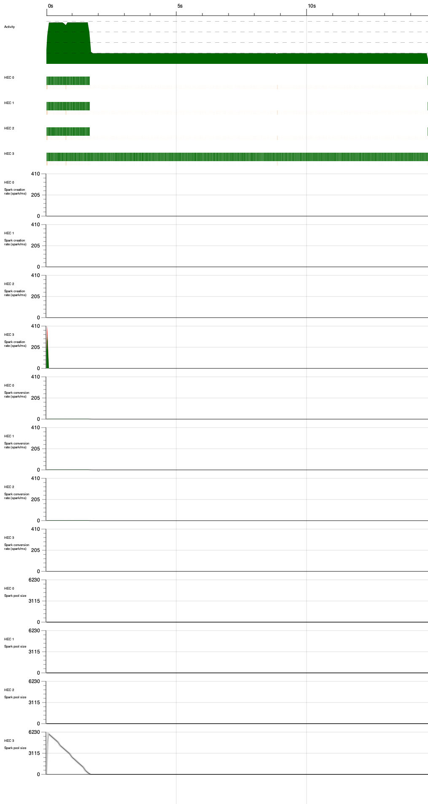

   `parBuffer`

   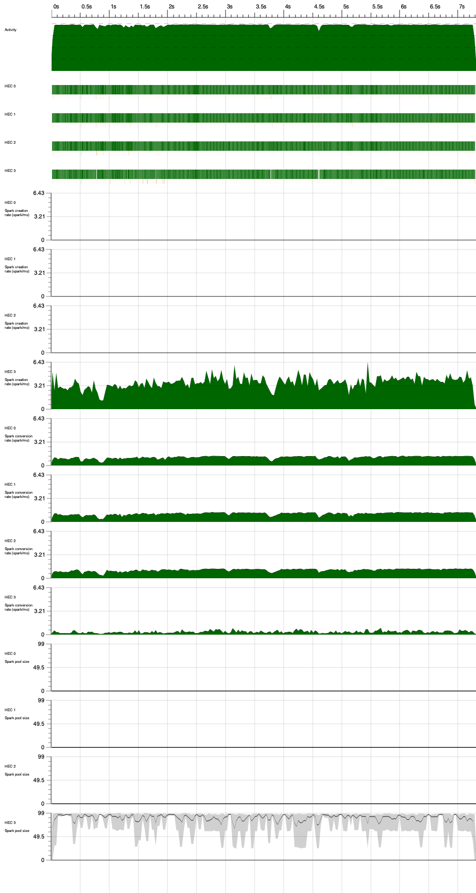

   While `parList` creates sparks for all list elements immediately upon evaluation, `parBuffer` maintains a fixed-size of active sparks. 

   ThreadScope’s spark pool graph shows that `parBuffer` really does keep a constant supply of sparks, with the heap size growing in a controlled manner as elements are processed. The spark pool on HEC 3 constantly hovers around 90-100 sparks. By contrast, parList often creates a memory spike at the beginning as it tries to spark all elements at once. 
   These behaviors make `parBuffer`  well-suited for processing infinite or very large streams, where unbounded spark creation would overwhelm the system. It also ensures that parallelism is spread throughout the entire computation rather than concentrated at the beginning.

3. When combine chunking with `parBuffer`, the data is first divided into work units. Then `parBuffer` maintains a fixed number of these chunks in parallel evaluation. This two-level approach provides several advantages. 

   Using chunk reduces the total number of sparks created by grouping elements into batches. However, chunk size involves a trade-off . Larger chunks decrease scheduling costs but risk uneven load balancing. 

   The buffering ensures that chunks are evaluated in a controlled manner. This prevents the system from being overwhelmed with too many chunks at once, while still maintaining parallel evaluation throughout the computation. By only keeping a limited number of chunks active at any time, memory usage remains more predictable and the runtime system can manage resources more effectively. 