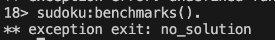
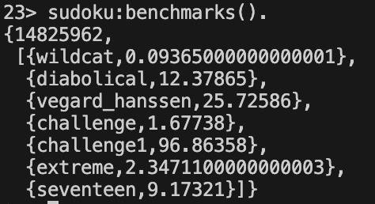
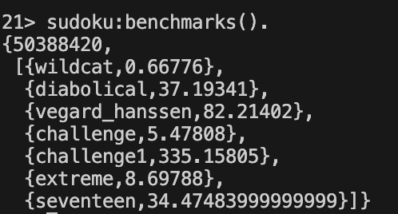
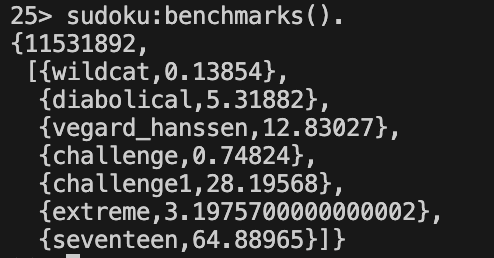

# Report

## Parallel Refine Rows

1. To speed up the costly refine function , we attempted a simple parallelization using `spawn_link` :

   ```erlang
   refine_rows_parallel(M) ->
       Parent = self(),
       WithIndex = lists:zip(lists:seq(1, length(M)), M),
       [spawn_link(fun() -> Parent ! {Index, refine_row(Row)} end) || {Index, Row} <- WithIndex],
       Results = [receive {I, R} -> {I, R} end || _ <- M],
       Sorted = lists:keysort(1, Results),
       [R || {_, R} <- Sorted].
   ```

2. When running `sudoku:benchmarks().`, we observed an unexpected crash:

   

   Check which part of code has triggered exit and we found that when refining rows in **parallel**, the check `length(lists:usort(NewEntries)) == length(NewEntries)` in `refine_row/1` can trigger `false` 

   

   By analyzing the solver's control flow, we recognized that unhandled `no_solution` exceptions during refinement terminates the solver, resulting in an  incomplete solution.

   ```erlang
   solve_one([M|Ms]) ->
        case catch solve_refined(M) of
    	{'EXIT',no_solution} ->
    	    solve_one(Ms);
    	Solution ->
    	    Solution
        end.
   ```

   We need to handle the potential errors properly and ensure that process failures are communicated back to the parent process. After modification :

   ```erlang
   refine_rows(M) ->
       Parent = self(), 
       Ref = make_ref(),
       WithIndex = lists:zip(lists:seq(1, length(M)), M),
   
       [spawn_link(fun() -> 
           Result = (catch refine_row(Row)),
           case Result of
               {'EXIT', no_solution} ->
                   Parent ! {Ref, Index, no_solution};
               ValidRow ->
                   Parent ! {Ref, Index, {ok, ValidRow}}
           end
       end) || {Index, Row} <- WithIndex],
   
       Results = [receive 
                      {Ref, _, no_solution} -> 
                          exit(no_solution);  % Propagate the error up
                      {Ref, I, {ok, Row}} -> 
                          {I, Row}
                  end || _ <- M],
   
       Sorted = lists:keysort(1, Results),
       [R || {_, R} <- Sorted].
   ```

   The benchmark results presented a consistent slowdown across all tested puzzles after implementing parallel processing in the solver. We assume that the slowdown happened because the method of splitting the work into parallel tasks ended up creating more extra work than it saved.

   | Original                                                     | Parallel                                                     |
   | ------------------------------------------------------------ | ------------------------------------------------------------ |
   |  |  |

   TODO: Performance analysis using tools?

## Parallel Solve

1. To address this, we try to parallelize at the guess level, where each process handles a fully independent puzzle state derived from a distinct guess. 

   ```erlang
   solve_one([]) ->
       exit(no_solution);
   
   solve_one(Ms) ->
       Parent = self(),
       Ref = make_ref(),
       [spawn_link(fun() ->
           Result = (catch solve_refined(M)),
           Parent ! {Ref, Result}
       end) || M <- Ms],
   
       receive
           {Ref, {'EXIT', no_solution}} ->
               solve_one_collect(Ref, length(Ms) - 1);
           {Ref, Solution} ->
               Solution
       end.
   
   solve_one_collect(_, 0) ->
       exit(no_solution);
   solve_one_collect(Ref, N) ->
       receive
           {Ref, {'EXIT', no_solution}} ->
               solve_one_collect(Ref, N - 1);
           {Ref, Solution} ->
               Solution
       end.
   ```

   

   We observed speed up differences between solving different puzzles. The solving time for the "extreme" puzzle, particularly "seventeen," increased significantly.

2. Upon reading how the original solve works, we decided to implement 2 variation of worker pool parallelisation to speed up the run time. The 2 being `pool solve` & `limited_par solve`.

 
3. The `pool_solve` function seeks to parallelize every branch in the guessing phase. It does so by using a registered pool process to manage a fixed number of workers. At each branching point, one branch is explored locally while another is explored in paralell by a designating a worker to do that.


    ```erlang
    pool_solve_one([M|Ms]) ->
    %% Speculate on remaining guesses
    Rest = speculate_on_worker(fun() ->
        try pool_solve_one(Ms)
        catch exit:no_solution -> false
        end
    end),
    case catch pool_solve_refined(M) of
        {'EXIT', no_solution} ->
            case worker_value_of(Rest) of
                false -> exit(no_solution);
                Solution -> Solution
            end;
        Solution -> Solution
    end.

    ```
After which, each speculative task is sent to an available worker from the pool via:

    ```erlang
    speculate_on_worker(F) ->
    case whereis(pool) of
        undefined -> ok;
        Pool -> Pool ! {get_worker, self()}
    end,
    receive
        {pool, no_worker} -> {not_speculating, F};
        {pool, W} ->
            Ref = make_ref(),
            W ! {task, self(), Ref, F},
            {speculating, Ref}
    end.
    ```

4. `limited_par_solve` tries to provide a more controlled parallelism. Pool solve may create unnecessary  overhead when the tree is shallow due to spwaning too many processes. This method overcoems this problem by controlling the depth of which parallelism occurs. Only guesses within the depth threshold are executed speculatively (in parallel). Deeper branches fall back to sequential execution. This aims to balance parallel speedup and overhead to create an even faster solve.

    ```erlang
    limited_par_solve_one([M|Ms], Depth) when Depth < 8 ->
    Rest = speculate_on_worker(fun() ->
        try limited_par_solve_one(Ms, Depth + 1)
        catch exit:no_solution -> false
        end
    end),
    case catch limited_par_solve_refined(M, Depth + 1) of
        {'EXIT', no_solution} ->
            case worker_value_of(Rest) of
                false -> exit(no_solution);
                Solution -> Solution
            end;
        Solution -> Solution
    end;
    limited_par_solve_one([M|Ms], _) ->
    %% Fallback to sequential solving
    case catch solve_refined(M) of
        {'EXIT', no_solution} -> solve_one(Ms);
        Solution -> Solution
    end.

    ```
Increaing depth (Depth < N) allows us to control how much of the tree is searched in paralell.

5. 