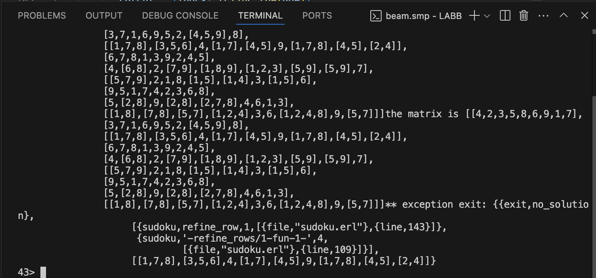

# Report

## Refine

1. First try simply use spawn_link to make  refine_rows parallel but no_solution.

   ```erlang
   refine_rows(M) ->
       Parent = self(),
       WithIndex = lists:zip(lists:seq(1, length(M)), M),
       [spawn_link(fun() -> Parent ! {Index, refine_row(Row)} end) || {Index, Row} <- WithIndex],
       Results = [receive {I, R} -> {I, R} end || _ <- M],
       Sorted = lists:keysort(1, Results),
       [R || {_, R} <- Sorted].
   ```

   Check which part of code has triggered exit and we found that ...

   When refining rows in **parallel**, the check `length(lists:usort(NewEntries)) == length(NewEntries)` in `refine_row/1` can trigger `false` (indicating duplicates) 

   

   due to **lack of coordination between parallel row refinements**. 

   - All rows/columns/blocks are refined **simultaneously**.
   - No coordination between these refine processes. Two rows might independently fix values in the same column/block.
   - This can lead to **row-internal duplicates** because the refinement of one row doesn’t consider concurrent changes in others.

2. structure the refinement process into **sequential phases** while allowing **parallelism within each phase** 