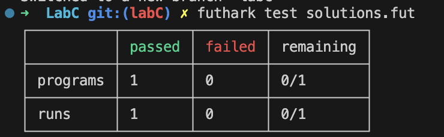

# Report

## Exercise 1

### 1.2

### 1.3

My laptop configuration:
- CPU: Apple M1 (8‑core)
- GPU: Apple M1 integrated 8‑core GPU

Run `make solutions-opencl.json` & `make solutions-c.json`

## Exercise 2

### 2.1

For (0,false)  to be a left-neutral element of ⊕', we need to show that

(0,false) ⊕' (v,f) = (v,f) for any (v,f).

- f = true:

  (0,false) ⊕' (v,true) = (v, false ∨ true) = (v, true)

- f = false:

  (0,false) ⊕' (v,false) = (0 ⊕ v, false ∨ false) = (0 ⊕ v, false)

since 0 is the neutral element for ⊕, we have 0  ⊕  v  =  v. So, (0,false) ⊕' (v,false) = (v, false).

Therefore, in both cases, (0,false) ⊕' (v,f) = (v,f).

This proves that (0,false) is a left-neutral element of ⊕'.

### 2.2

Benchmark the performance of segmented scan versus ordinary scan, and segmented reduce versus ordinary reduction, and show the result

vs `scan` and `reduce`?

But they do the different things like their outputs not the same just test the time?

